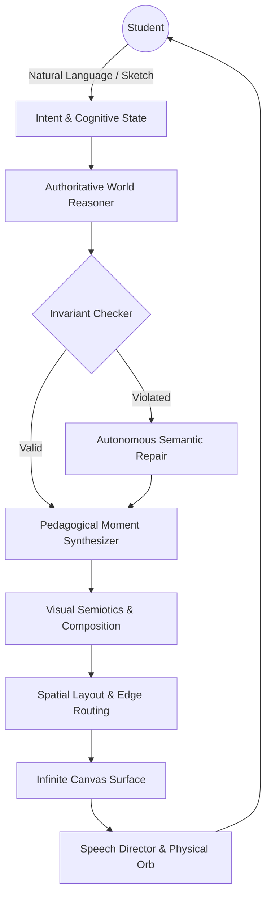
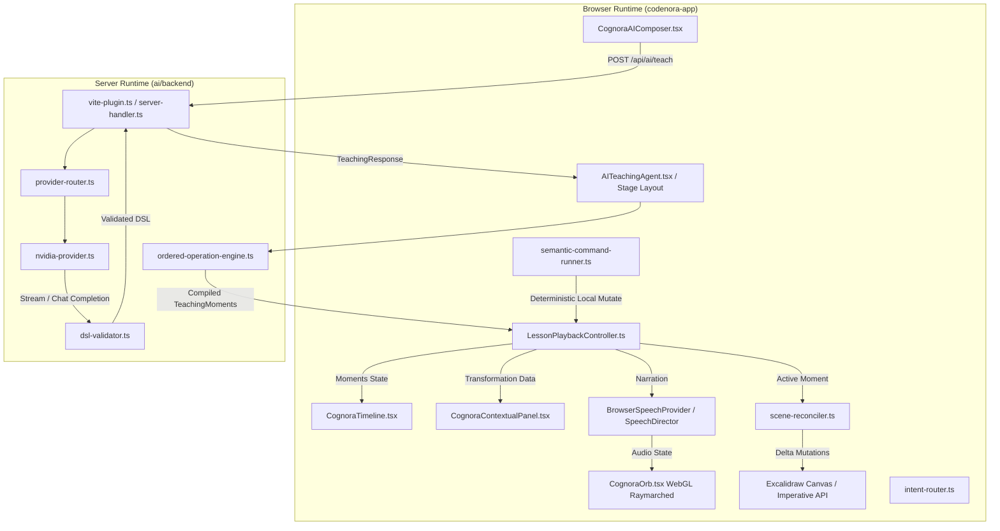
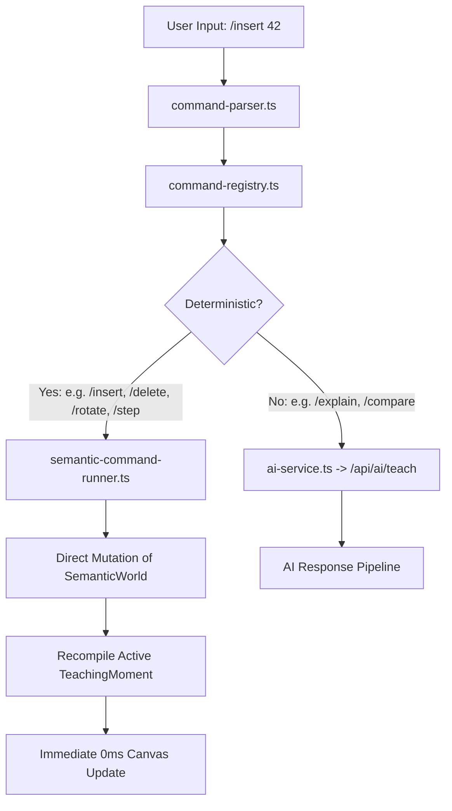
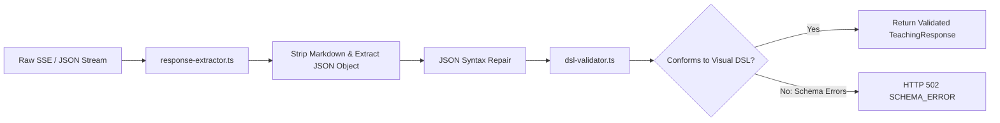
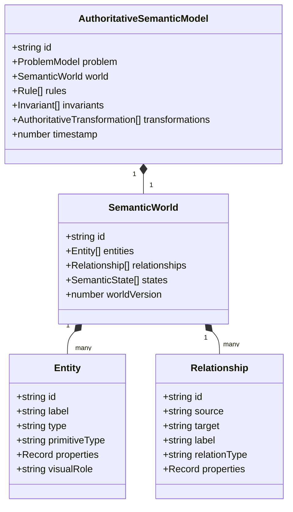
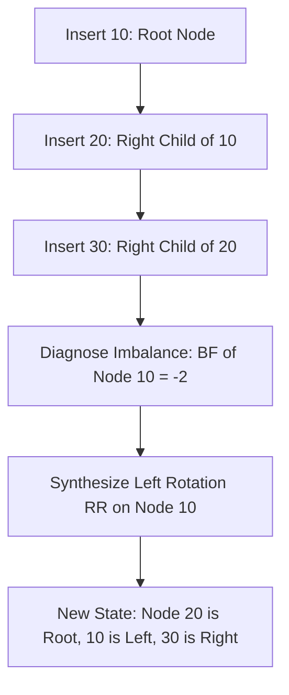
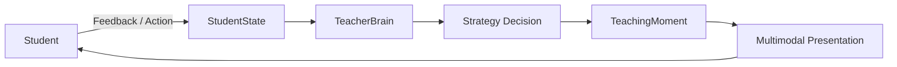
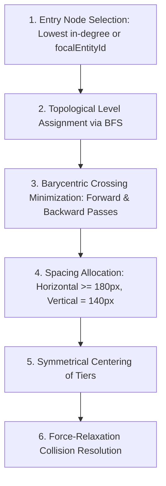
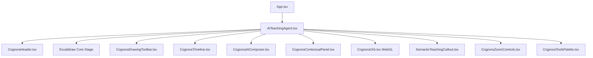
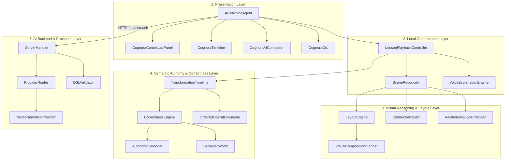

# COGNORA: Complete System Architecture & Technical Documentation
## AI-Native Visual Learning Environment
**Document Classification**: Comprehensive Technical Reference Manual  
**Author**: Cognora Core Architectural Engineering Team  
**Repository**: `codenora-monorepo` (`codenora-app`, `packages/*`)  
**Target Audience**: Systems Engineers, AI Researchers, Frontend Architects, and New Contributors  
**Baseline Git Commit**: `ef503ff9` (Production Stabilization & Visual Reasoning Engine 5.0)  
**Date of Record**: September 2026  

---

## Source of Truth & Status Classification Taxonomy
Every feature, subsystem, and interface described in this technical documentation is classified strictly according to the following truth taxonomy:

| Status Badge | Meaning in Repository |
| :--- | :--- |
| **`[IMPLEMENTED]`** | Fully realized in active source code, covered by automated test suites, actively running in the runtime call path. |
| **`[PARTIALLY IMPLEMENTED]`** | Core logic or interfaces exist; specific edge cases, UI bindings, or fallbacks are incomplete or in progress. |
| **`[EXPERIMENTAL]`** | Active feature branch or opt-in subsystem under evaluation (e.g. WebGL Raymarched Shaders, Voice WebRTC). |
| **`[PLANNED]`** | Documented in interfaces or architectural roadmaps but not yet wired to active runtime execution. |
| **`[LEGACY]`** | Superseded by newer architectures but retained in codebase for backwards compatibility or fallback. |
| **`[DEPRECATED]`** | Scheduled for imminent removal; must not be used in new features. |

---

# TABLE OF CONTENTS

1. [Executive Overview & Pedagogical Philosophy](#1-executive-overview--pedagogical-philosophy)
2. [System Architecture: Conceptual vs Runtime](#2-system-architecture-conceptual-vs-runtime)
3. [The Complete Request-to-Canvas Pipeline](#3-the-complete-request-to-canvas-pipeline)
4. [User Input & Intent Recognition System](#4-user-input--intent-recognition-system)
5. [Universal Command System](#5-universal-command-system)
6. [AI Subsystem: NVIDIA Nemotron & Multi-Provider Architecture](#6-ai-subsystem-nvidia-nemotron--multi-provider-architecture)
7. [AI Response Ingestion & Schema Validation Pipeline](#7-ai-response-ingestion--schema-validation-pipeline)
8. [Authoritative Semantic World](#8-authoritative-semantic-world)
9. [Authoritative Correctness Engine & Invariant Verification](#9-authoritative-correctness-engine--invariant-verification)
10. [Deep Case Study 1: AVL Tree Insertion & Rotations](#10-deep-case-study-1-avl-tree-insertion--rotations)
11. [Deep Case Study 2: Dijkstra's Shortest Path Algorithm](#11-deep-case-study-2-dijkstras-shortest-path-algorithm)
12. [Pedagogical Teaching Engine & Teacher Brain](#12-pedagogical-teaching-engine--teacher-brain)
13. [Adaptive Teaching Loop & Learner State Model](#13-adaptive-teaching-loop--learner-state-model)
14. [Anatomy of a TeachingMoment](#14-anatomy-of-a-teachingmoment)
15. [Visual Composition Engine (Visual Reasoning 5.0)](#15-visual-composition-engine-visual-reasoning-50)
16. [Geometry & Layout Engine](#16-geometry--layout-engine)
17. [General Graph Layout Engine](#17-general-graph-layout-engine)
18. [Hierarchical Tree & Ordered Sequence Layouts](#18-hierarchical-tree--ordered-sequence-layouts)
19. [Connector Routing & Parallel Track Geometry](#19-connector-routing--parallel-track-geometry)
20. [Relationship Label Placement & Corridor Clearance](#20-relationship-label-placement--corridor-clearance)
21. [Excalidraw Canvas Integration & Custom Data Bindings](#21-excalidraw-canvas-integration--custom-data-bindings)
22. [Scene Reconciliation & Stable Identity Conservation](#22-scene-reconciliation--stable-identity-conservation)
23. [Pure-Local Playback Controller & Interactive Timeline](#23-pure-local-playback-controller--interactive-timeline)
24. [The Contextual Inspector Subsystem](#24-the-contextual-inspector-subsystem)
25. [The Tutor Conversational Subsystem](#25-the-tutor-conversational-subsystem)
26. [Semantic Teaching Callout System](#26-semantic-teaching-callout-system)
27. [Voice Subsystem: Browser Speech Director & TTS Fallbacks](#27-voice-subsystem-browser-speech-director--tts-fallbacks)
28. [CognoraOrb: 3D Liquid Glass Physical Presence](#28-cognoraorb-3d-liquid-glass-physical-presence)
29. [Follow-Up Context & Relative Query Resolution](#29-follow-up-context--relative-query-resolution)
30. [Counterfactual What-If Branching Engine](#30-counterfactual-what-if-branching-engine)
31. [History, State Immutability, & Session Memory](#31-history-state-immutability--session-memory)
32. [Frontend Architecture & React Component Hierarchy](#32-frontend-architecture--react-component-hierarchy)
33. [Backend Server Architecture & Vite Middleware](#33-backend-server-architecture--vite-middleware)
34. [Comprehensive Data Flow Maps](#34-comprehensive-data-flow-maps)
35. [Subsystem Error Isolation & Resilience Architecture](#35-subsystem-error-isolation--resilience-architecture)
36. [Performance Budgets & Computational Bottlenecks](#36-performance-budgets--computational-bottlenecks)
37. [Security Architecture & Secret Boundary Isolation](#37-security-architecture--secret-boundary-isolation)
38. [Complete Repository Directory Map](#38-complete-repository-directory-map)
39. [Exhaustive File-by-File Architectural Matrix](#39-exhaustive-file-by-file-architectural-matrix)
40. [Subsystem Dependency & Coupling Architecture](#40-subsystem-dependency--coupling-architecture)
41. [Testing Architecture & Verification Strategy](#41-testing-architecture--verification-strategy)
42. [Deployment Architecture & Operational Environment](#42-deployment-architecture--operational-environment)
43. [Known Limitations & Technical Debt Audit](#43-known-limitations--technical-debt-audit)
44. [Current Implementation vs Intended Architecture Matrix](#44-current-implementation-vs-intended-architecture-matrix)
45. [Developer Modification & Extension Guide](#45-developer-modification--extension-guide)
46. [How to Add a New Domain or Algorithm](#46-how-to-add-a-new-domain-or-algorithm)
47. [Core Architectural Invariants](#47-core-architectural-invariants)
48. [End-to-End Walkthrough Trace: Dijkstra Algorithm](#48-end-to-end-walkthrough-trace-dijkstra-algorithm)
49. [End-to-End Walkthrough Trace: AVL Tree Balancing](#49-end-to-end-walkthrough-trace-avl-tree-balancing)
50. [Cognora Technical Glossary](#50-cognora-technical-glossary)
51. [System at a Glance: Definitive Architecture Map](#51-system-at-a-glance-definitive-architecture-map)

---

# 1. EXECUTIVE OVERVIEW & PEDAGOGICAL PHILOSOPHY

### What is Cognora? `[IMPLEMENTED]`
**Cognora** is an AI-native visual learning environment that transforms complex computer science algorithms, mathematical systems, and architectural relationships into interactive, progressive, spatial teaching experiences rendered on an infinite digital canvas.

### The Problem Space
Computer science education suffers from two fundamental failures:
1. **Static, Unresponsive Visuals**: Traditional textbook diagrams show final states (e.g. a balanced AVL tree or a completed Dijkstra shortest-path tree) without elucidating the progressive mechanical decisions, temporary invariant violations, and causal trade-offs that occurred during execution.
2. **Hallucinatory Raw LLM Output**: Standard generative AI interfaces output unverified, markdown-heavy walls of text. When asked to draw diagrams, LLMs frequently hallucinate incorrect tree connections, place nodes over one another, violate balance factor invariants, or invent nonexistent graph edges.

### The Central Philosophy: Separation of Meaning, Correctness, and Rendering
Cognora solves this by enforcing strict architectural separation of concerns:

```
[ AI PROVIDER ]            -> Understands Intent & Natural Language Meaning
      |
      v
[ CORRECTNESS ENGINE ]     -> Formally Verifies Mathematical & Algorithmic Truth
      |
      v
[ SEMANTIC WORLD ]         -> Holds Authoritative Immutable World State & Invariants
      |
      v
[ TEACHER BRAIN ]          -> Decides Cognitive Load, Pacing, & What Learner Sees
      |
      v
[ VISUAL COMPOSITION ]     -> Chooses Semiotic Strategy (Tree vs Graph vs Sequence)
      |
      v
[ LAYOUT ENGINE ]          -> Computes Deterministic Collision-Free 2D Coordinates
      |
      v
[ EXCALIDRAW ENGINE ]      -> Renders Native Elements, Bindings, & Hand-Drawn Strokes
      |
      v
[ MULTIMODAL ACTORS ]      -> Voice Narration, WebGL Liquid Glass Orb, Contextual Inspector
```

- **AI is NOT authoritative**: The LLM's role is semantic extraction and pedagogical explanation. It is prohibited from calculating raw screen pixel coordinates.
- **Excalidraw is NOT authoritative**: Canvas elements are transient projections of underlying semantic entities. Modifying an arrow or rectangle on the canvas does not corrupt the mathematical state.
- **Code enforces the laws of physics**: A binary search tree cannot violate $Left < Parent < Right$; an AVL tree cannot leave balance factor $|BF| > 1$ unresolved; a Dijkstra edge cannot be relaxed unless $dist[u] + w < dist[v]$.

---

# 2. SYSTEM ARCHITECTURE: CONCEPTUAL VS RUNTIME

Cognora maintains two distinct architectural models: the idealized conceptual pipeline and the actual production execution graph.

### 2.1 Conceptual Architecture `[PLANNED / REFERENCE]`
The conceptual model assumes an entirely asynchronous, event-driven cycle where a student's cognitive state is continuously modeled:



### 2.2 Actual Runtime Architecture `[IMPLEMENTED]`
In production, Cognora operates as a hybrid client-server React application embedded in Vite, where the backend runs as embedded dev/preview server middleware and the frontend executes all lesson playback 100% locally:



---

# 3. THE COMPLETE REQUEST-TO-CANVAS PIPELINE

Tracing a standard user question (e.g. *"Explain how an AVL tree balances when inserting 10, 20, 30"*) across all 17 stages:

| Stage # | Stage Name | Implementation Location | Input | Output | Error Boundary |
| :--- | :--- | :--- | :--- | :--- | :--- |
| **1** | Input Capture | `CognoraAIComposer.tsx` | User keystrokes / prompt text | Raw prompt string | Truncate > 4000 chars |
| **2** | Intent Classification | `ai/intent-router.ts` | Raw prompt string | `UserIntent` (DSA, meta, cmd) | Falls back to `"CONCEPT_EXPLANATION"` |
| **3** | Request Construction | `ai/ai-service.ts` | Prompt + Canvas Context | `TeachingRequest` JSON | Abort on empty string |
| **4** | Server Ingestion | `ai/backend/server-handler.ts` | HTTP POST `/api/ai/teach` | Sanitized request object | 413 Payload Too Large / 400 Bad JSON |
| **5** | In-Flight Deduplication | `ai/backend/server-handler.ts` | `generationId` + prompt hash | Shared Promise / Cached call | Prevents parallel duplicate LLM bills |
| **6** | Provider Invocation | `ai/backend/nvidia-provider.ts` | System prompt + User query | NVIDIA OpenAI-compatible payload | 502/504 Timeout / Circuit breaker |
| **7** | Response Extraction | `ai/backend/response-extractor.ts`| Raw SSE stream / JSON string | Parsed JSON object | Strip markdown ticks / JSON repair |
| **8** | Schema Validation | `ai/backend/dsl-validator.ts` | Parsed JSON object | `ValidTeachingResponse` | 502 Bad Gateway if schema invalid |
| **9** | Ordered De-collapse | `ai/ordered-operation-engine.ts` | Visual lesson proposal | Step-by-step uncollapsed steps | Synthesizes baseline State 0 + rotations |
| **10** | Correctness Verification| `ai/correctness-engine.ts` | Raw transformations + World | `AuthoritativeSemanticModel` | Repair dangling links / reject bogus steps |
| **11** | Moment Compilation | `ai/transformation-timeline.ts` | Validated model + Invariants | `TeachingMoment[]` array | Throws `TimelineCompilationError` |
| **12** | Composition Planning | `ai/visual-reasoning/` | `SemanticWorld` relationships | `VisualCompositionPlan` | Fallback to `"network"` / `"pipeline"` |
| **13** | Spatial Layout | `ai/layout-engine.ts` | Entities + Strategy | 2D Bounding Boxes (`positions` Map)| Fallback to circular distribution |
| **14** | Connector Routing | `ai/visual-reasoning/` | Node perimeters + obstacles | Bezier / Direct connector routes | Flank routing fallback around obstacles |
| **15** | Label Placement | `ai/visual-reasoning/` | Connector routes + labels | BoundingBox positions | Corridor-clear normal projection |
| **16** | Scene Reconciliation | `ai/scene-reconciler.ts` | Visual Elements vs Canvas | Excalidraw Element mutations | Preserves element identity (`customData`) |
| **17** | Presentation Render | Canvas, Panel, Orb, Voice | Active `TeachingMoment` | Visual render + Voice audio | Native speech synthesis with fallback |

---

# 4. USER INPUT & INTENT RECOGNITION SYSTEM

Cognora provides four input channels:

### 4.1 Natural Language Processing `[IMPLEMENTED]`
- Captured in [`CognoraAIComposer.tsx`](file:///c:/Users/venka/Desktop/excalidraw/codenora-app/components/CognoraAIComposer.tsx).
- Evaluated by [`intent-engine.ts`](file:///c:/Users/venka/Desktop/excalidraw/codenora-app/ai/intelligence/intent-engine.ts) and [`question-understanding.ts`](file:///c:/Users/venka/Desktop/excalidraw/codenora-app/ai/question-understanding.ts).
- Detects concept taxonomy: Data Structures (`Tree`, `Graph`, `Heap`, `Linked List`, `Array`), Algorithms (`Dijkstra`, `BFS`, `DFS`, `Binary Search`, `Quick Sort`, `Merge Sort`), Systems (`LRU Cache`, `TCP Handshake`, `Transactions`).

### 4.2 Slash Commands (`/`) `[IMPLEMENTED]`
- Triggered when input begins with `/`.
- Autocomplete palette opens via [`CognoraCommandPalette.tsx`](file:///c:/Users/venka/Desktop/excalidraw/codenora-app/components/CognoraCommandPalette.tsx).
- Real-time argument parsing and typing handled by [`command-parser.ts`](file:///c:/Users/venka/Desktop/excalidraw/codenora-app/ai/commands/command-parser.ts).

### 4.3 Handwriting & Ink Drawing `[IMPLEMENTED]`
- Supported via Excalidraw freehand tool.
- [`handwriting-command-detector.ts`](file:///c:/Users/venka/Desktop/excalidraw/codenora-app/ai/commands/handwriting-command-detector.ts) analyzes stroke sequences to detect user-drawn gestures (e.g., crossing out a node $\rightarrow$ delete command; drawing an arrow $\rightarrow$ connect command).

### 4.4 Follow-Up & Meta Questions `[IMPLEMENTED]`
- Handled by [`context-engine.ts`](file:///c:/Users/venka/Desktop/excalidraw/codenora-app/ai/intelligence/context-engine.ts).
- Resolves relative queries ("Why did that happen?", "Show that again", "Go slower") by binding directly to the active `TeachingMoment` and `worldVersion`.

---

# 5. UNIVERSAL COMMAND SYSTEM

Cognora features a dual-track command architecture: **Deterministic Local Commands** and **AI-Assisted Remote Commands**.



### 5.1 Command Registry Taxonomy `[IMPLEMENTED]`
Defined in [`command-registry.ts`](file:///c:/Users/venka/Desktop/excalidraw/codenora-app/ai/commands/command-registry.ts):
- **Structural**: `/insert <val>`, `/delete <val>`, `/search <val>`, `/rotate <left|right>`, `/heapify`, `/relax <u, v, w>`.
- **Navigation & Playback**: `/step <next|prev|index>`, `/play`, `/pause`, `/speed <0.5|1|2>`, `/replay`, `/reset`.
- **Visual & Layout**: `/align`, `/compact`, `/expand`, `/theme <dark|light>`, `/clear`.
- **Pedagogical**: `/why`, `/compare`, `/whatif <param>`, `/practice`, `/quiz`.

---

# 6. AI SUBSYSTEM: NVIDIA NEMOTRON & MULTI-PROVIDER ARCHITECTURE

### 6.1 Provider Hierarchy & Selection `[IMPLEMENTED]`
The AI backend is located in `codenora-app/ai/backend/`. Ingestion is managed by `ProviderRouter` (`provider-router.ts`), which routes requests based on environment variables:

```
ProviderRouter (Default)
  ├── 1. NvidiaNemotronProvider (Primary Production Model: nvidia/nemotron-3-ultra-550b-a55b)
  ├── 2. FeatherlessTeachingProvider (Fallback Serverless Llama/Qwen)
  ├── 3. OllamaTeachingProvider (Local Offline LLM: e.g. llama3:8b)
  └── 4. MockTeachingProvider (Zero-Network Synthetic Unit Test Provider)
```

### 6.2 NVIDIA Integration Specifics
- **Endpoint**: `https://integrate.api.nvidia.com/v1/chat/completions` (OpenAI compatible).
- **Default Model**: `nvidia/nemotron-3-ultra-550b-a55b`.
- **Token Budget**: 32,768 tokens (configured via `NVIDIA_MAX_TOKENS`).
- **Temperature**: `0.2` (enforces deterministic pedagogical consistency).
- **Deduplication Engine**: `inFlightGenerations` Map in `server-handler.ts` coalesces identical in-flight submissions under a single promise to eliminate duplicate token consumption.

---

# 7. AI RESPONSE INGESTION & SCHEMA VALIDATION PIPELINE

When NVIDIA Nemotron responds, raw text undergoes a multi-layer validation gate:



### 7.1 Schema Validation Protocol `[IMPLEMENTED]`
[`dsl-validator.ts`](file:///c:/Users/venka/Desktop/excalidraw/codenora-app/ai/backend/dsl-validator.ts) enforces:
- Presence of valid `topic`, `concept`, and `initialState`.
- Every step contains an `action`, `semanticFocus`, `title`, and `explanation`.
- Entity coordinates are **prohibited**; the LLM is only permitted to specify abstract semantic entities and relationships.

---

# 8. AUTHORITATIVE SEMANTIC WORLD

The **Semantic World** is the single source of truth for the educational state.



### Entity Conservation Law `[IMPLEMENTED]`
When an entity moves, updates value, or changes highlight state, its `id` **must remain invariant**. Re-generating entities with new random IDs between steps is strictly prohibited by `SemanticRepairEngine` (`correctness-engine.ts`), preventing visual jitter and preserving smooth animations in Excalidraw.

---

# 9. AUTHORITATIVE CORRECTNESS ENGINE & INVARIANT VERIFICATION

Located in [`correctness-engine.ts`](file:///c:/Users/venka/Desktop/excalidraw/codenora-app/ai/correctness-engine.ts), the **Universal Correctness Engine** runs a 16-point validation suite:

1. **Question Interpretation**: Verifies non-empty pedagogical intent.
2. **Problem Model**: Validates objective and explicit constraints.
3. **Assumptions Audit**: Limits implicit assumptions.
4. **Semantic Entities Check**: Purges orphan identifiers and generates default labels.
5. **Relationship Integrity**: Prunes dangling edges whose source or target do not exist.
6. **Rule Evaluation**: Verifies domain rules (e.g. tree is acyclic).
7. **Constraint Checking**: Ensures value bounds and capacity constraints hold.
8. **Initial State (State 0) Synthesis**: Guarantees true baseline state exists.
9. **Derived Value Calculation**: Deterministically calculates depths, heights, and degrees.
10. **Invariant Verification**: Checks mathematical domain invariants.
11. **Anti-Fake-Step Validation**: Eliminates zero-diff consecutive identical states.
12. **Timeline Continuity**: Proves that $S_n = \text{Apply}(S_{n-1}, T_n)$.
13. **Final State Verification**: Verifies problem goal is achieved.
14. **Goal Satisfaction Report**: Produces formal report of passed criteria.
15. **Explanation Consistency**: Ensures prose matches visual state transitions.
16. **Visual-Semantic Readiness**: Validates all entities are mappable to visual primitives.

---

# 10. DEEP CASE STUDY 1: AVL TREE INSERTION & ROTATIONS

To demonstrate how semantic state, invariant validation, and visual composition interact, consider inserting keys `[10, 20, 30]` into an AVL Tree:



### 10.1 Four Progressive Teaching Steps `[IMPLEMENTED]`
Implemented in [`ordered-operation-engine.ts`](file:///c:/Users/venka/Desktop/excalidraw/codenora-app/ai/ordered-operation-engine.ts) (`synthesizeTreeSteps`):
1. **BST Insertion Step**: Node `30` is placed as right child of `20`.
2. **Height & Balance Factor Update**: Heights recalculate ($h(10)=3, h(20)=2, h(30)=1$). Balance factor of root `10` violates invariant: $BF(10) = h(left) - h(right) = 0 - 2 = -2$.
3. **Rotation Diagnosis & Execution**: System classifies violation as **RR Case** (Right-Right skew). Left rotation synthesized at node `10`.
4. **Equilibrium State**: Node `20` becomes root ($BF=0$), `10` becomes left child ($BF=0$), `30` becomes right child ($BF=0$). Previous historical canvas trees are cleanly purged from the scene.

---

# 11. DEEP CASE STUDY 2: DIJKSTRA'S SHORTEST PATH ALGORITHM

Tracing Dijkstra's algorithm across an undirected weighted graph:
```
       ( A )
      /     \
    4/       \2
    /         \
 ( B )---1---( C )
  \         /   \
  5\       /8    \10
    \     /       \
     ( D )---2---( E )
```

### 11.1 The Operational Execution Stages `[IMPLEMENTED]`
Synthesized by `OrderedOperationEngine.synthesizeDijkstraSteps`:
1. **Baseline State 0**: Graph initialized. $dist[A] = 0$, all other nodes $\infty$. Priority Queue initialized with $(A, 0)$.
2. **Pop Source Node A**: Mark $A$ as visiting (`highlight = "visiting"`). Inspect incident edges $(A, B, 4)$ and $(A, C, 2)$.
3. **Relax Edge $A \rightarrow C$**: $0 + 2 < \infty \implies dist[C] = 2, pred[C] = A$. Push $(C, 2)$ to queue.
4. **Relax Edge $A \rightarrow B$**: $0 + 4 < \infty \implies dist[B] = 4, pred[B] = A$. Push $(B, 4)$ to queue.
5. **Pop Minimum Unvisited Node C**: $dist[C] = 2$ is finalized. Evaluate edges to $B, D, E$:
   - Cross-edge $C \rightarrow B$ with weight 1: $2 + 1 = 3 < dist[B] (4)$. **Relax $B$!** $dist[B] \leftarrow 3, pred[B] \leftarrow C$.
   - Edge $C \rightarrow D$ with weight 8: $2 + 8 = 10 < \infty \implies dist[D] = 10, pred[D] = C$.
   - Edge $C \rightarrow E$ with weight 10: $2 + 10 = 12 < \infty \implies dist[E] = 12, pred[E] = C$.
6. **Pop Node B**: $dist[B] = 3$ is finalized. Edge $B \rightarrow D$ with weight 5: $3 + 5 = 8 < dist[D] (10)$. **Relax $D$!** $dist[D] \leftarrow 8, pred[D] \leftarrow B$.
7. **Shortest-Path Reconstruction Moment**: System extracts predecessor pointers and renders the authoritative Shortest-Path Tree in high-contrast cyan/emerald.

---

# 12. PEDAGOGICAL TEACHING ENGINE & TEACHER BRAIN

The **Teacher Brain** ([`teacher-brain.ts`](file:///c:/Users/venka/Desktop/excalidraw/codenora-app/ai/intelligence/teacher-brain.ts)) governs cognitive budgeting:
- **Pacing**: Dynamically determines whether an operation requires micro-stepping (e.g. pointer swaps) or macro-stepping.
- **Cognitive Load Controller**: Limits the number of simultaneous visual highlights in a single moment to $\le 3$ elements.
- **Adaptive Strategy**: Adjusts depth based on student feedback ("I don't understand" splits the current transformation into fine-grained atomic steps).

---

# 13. ADAPTIVE TEACHING LOOP & LEARNER STATE MODEL



The learner state model ([`student-state.ts`](file:///c:/Users/venka/Desktop/excalidraw/codenora-app/ai/intelligence/student-state.ts)) tracks:
- `comprehensionScore`: Moving average of concept mastery $[0.0, 1.0]$.
- `confusionIndicators`: Counter for repeated pauses, replays, or "why" queries.
- `pacePreference`: `"slower" | "standard" | "faster"`.

---

# 14. ANATOMY OF A TEACHINGMOMENT

The canonical TypeScript interface defined in [`teaching-moment.ts`](file:///c:/Users/venka/Desktop/excalidraw/codenora-app/ai/teaching-moment.ts):

```typescript
export interface TeachingMoment {
  id: string;
  transformationId: string;
  stepIndex: number;
  totalSteps: number;
  worldVersion: number;
  branchId?: string;

  /** Authoritative visual scene state for this moment */
  visualState: SceneState;

  /** Explicit semantic focus target — no regex guessing from prose */
  semanticFocus: {
    type: "entity" | "relationship" | "operation" | "region";
    entityIds?: string[];
    relationshipIds?: string[];
    anchorPreference?: "center" | "top" | "bottom" | "left" | "right";
    label?: string;
  };

  title: string;
  explanation: string;
  whatChanged?: string;
  whyItChanged?: string;
  consequence?: string;

  /** Spoken script for speech synthesis */
  narration: string;

  /** Contextual Callout configuration */
  callout?: {
    text: string;
    placementPreference?: "above" | "below" | "left" | "right" | "floating";
  };

  /** Deep inspector content for lateral exploration */
  inspectorContent?: {
    why: string;
    calculations?: string;
    insight?: string;
    codeContext?: { code: string; language?: string };
  };

  playbackMetadata?: {
    durationHint?: number;
    importance?: "CRITICAL" | "HIGH" | "NORMAL" | "LOW";
  };
}
```

---

# 15. VISUAL COMPOSITION ENGINE (VISUAL REASONING 5.0)

Located in [`visual-composition-planner.ts`](file:///c:/Users/venka/Desktop/excalidraw/codenora-app/ai/visual-reasoning/visual-composition-planner.ts), the composition engine maps semantic relationships to spatial strategies:

| Primary Strategy | Detection Criteria | Semiotic Layout Form |
| :--- | :--- | :--- |
| **`"network"`** | Multi-parent in-degree > 1, cycles, weighted connections | Topology-Aware Layered Graph (Barycentric crossing reduction) |
| **`"hierarchical"`** | Single-parent acyclic hierarchy, parent/child relationships | Recursive Subtree Bounding Box Tree |
| **`"pipeline"`** | Sequential predecessor/successor chains, 1D order | Linear Sequential Flow (Horizontal Array / Linked List) |
| **`"table"`** | 2D row/column data, matrix structures, distance tables | Fixed Pitch Grid Table |
| **`"state_machine"`** | States, events, and circular transitions | Circular Radial Cluster with State Connectors |

---

# 16. GEOMETRY & LAYOUT ENGINE

Cognora generates 100% deterministic geometry via [`layout-engine.ts`](file:///c:/Users/venka/Desktop/excalidraw/codenora-app/ai/layout-engine.ts):
- AI models produce semantic topology, **never raw pixel coordinates**.
- Coordinates are computed relative to an origin $(X_0, Y_0)$ with standard clearances.
- Layout persistence: Unchanged nodes retain coordinates across steps to prevent disorienting camera jumps.

---

# 17. GENERAL GRAPH LAYOUT ENGINE `[IMPLEMENTED]`

The general graph layout algorithm operates in 6 deterministic stages:



This guarantees that graphs such as Dijkstra, Bellman-Ford, and state networks never collapse into a single vertical column.

---

# 18. HIERARCHICAL TREE & ORDERED SEQUENCE LAYOUTS `[IMPLEMENTED]`

### 18.1 Trees
- Root placed at top; levels spaced at $\Delta Y = 100\text{px}$.
- Subtree widths calculated recursively to prevent overlapping leaves.
- Left and right child slots maintained even when a child is absent.

### 18.2 Sequences & Arrays
- Linear array cells positioned at uniform horizontal pitch ($W = 60\text{px}, \text{gap} = 4\text{px}$).
- Doubly-linked lists allocate $40\text{px}$ gap for bidirectional pointer arrows.

---

# 19. CONNECTOR ROUTING & PARALLEL TRACK GEOMETRY `[IMPLEMENTED]`

Implemented in [`connector-router.ts`](file:///c:/Users/venka/Desktop/excalidraw/codenora-app/ai/visual-reasoning/connector-router.ts):
- **Exact Circular Perimeters**: Connectors terminate at exact perimeter coordinates:
  $$x = cx + r \cos \theta, \quad y = cy + r \sin \theta$$
- **Bidirectional Edges**: Parallel edges between nodes $A$ and $B$ route along canonical normal perpendicular offsets ($\Delta = 24\text{px}$), preventing collinear overlap.
- **Flank Detours**: Connectors detect intervening node obstacles and route cleanly above, below, or beside them.

---

# 20. RELATIONSHIP LABEL PLACEMENT & CORRIDOR CLEARANCE `[IMPLEMENTED]`

Implemented in [`relationship-label-planner.ts`](file:///c:/Users/venka/Desktop/excalidraw/codenora-app/ai/visual-reasoning/relationship-label-planner.ts):
- Edge weights project perpendicularly from edge midpoints along normal vectors (`mid-normal-pos`, `mid-normal-neg`).
- Rendered within high-contrast pill capsules to prevent connector stroke strike-through.
- Evaluates candidate positions against node bounding boxes to ensure zero node overlap.

---

# 21. EXCALIDRAW CANVAS INTEGRATION & CUSTOM DATA BINDINGS

Cognora embeds `@excalidraw/excalidraw` directly in React:
- Elements are bound using Excalidraw's `customData` payload:
  ```json
  {
    "cognora": {
      "entityId": "node-A",
      "primitiveType": "GraphNode",
      "worldVersion": 3,
      "isFocusTarget": true
    }
  }
  ```
- Excalidraw element IDs remain stable across scene reconciliations.

---

# 22. SCENE RECONCILIATION & STABLE IDENTITY CONSERVATION `[IMPLEMENTED]`

Located in [`scene-reconciler.ts`](file:///c:/Users/venka/Desktop/excalidraw/codenora-app/ai/scene-reconciler.ts):
- Instead of wiping and appending elements on each step, Cognora computes element diffs.
- Existing elements undergo property transitions (fill color, stroke, coordinates).
- Obsolete temporary elements are removed without disturbing persistent structural nodes.

---

# 23. PURE-LOCAL PLAYBACK CONTROLLER & INTERACTIVE TIMELINE `[IMPLEMENTED]`

Located in [`lesson-playback-controller.ts`](file:///c:/Users/venka/Desktop/excalidraw/codenora-app/ai/lesson-playback-controller.ts):
- All `TeachingMoments` are pre-compiled upon lesson generation.
- **Zero Network Round-Trips**: Play, Pause, Next, Previous, and Scrubbing execute in $0\text{ms}$ locally.
- Synchronizes audio narration, inspector content, camera viewport, and canvas elements.

---

# 24. THE CONTEXTUAL INSPECTOR SUBSYSTEM `[IMPLEMENTED]`

Located in [`CognoraContextualPanel.tsx`](file:///c:/Users/venka/Desktop/excalidraw/codenora-app/components/CognoraContextualPanel.tsx):
- Displays active transformation rationale, invariant validation reports, and code context.
- Four tabbed perspectives:
  1. **Analyze**: Invariant health, time/space complexity, operations count.
  2. **Explain**: Pedagogical prose, what changed, why it changed, consequence.
  3. **Code**: Live synchronized syntax-highlighted code with active line highlighting.
  4. **Practice**: Interactive self-check challenges generated for the current step.

---

# 25. THE TUTOR CONVERSATIONAL SUBSYSTEM `[IMPLEMENTED]`

Implemented in [`AITeachingAgent.tsx`](file:///c:/Users/venka/Desktop/excalidraw/codenora-app/components/AITeachingAgent.tsx):
- Provides contextual chat interface embedded alongside the canvas.
- Automatically injects the active `TeachingMoment`, selected canvas entities, and world version into follow-up prompts.

---

# 26. SEMANTIC TEACHING CALLOUT SYSTEM `[IMPLEMENTED]`

Located in [`SemanticTeachingCallout.tsx`](file:///c:/Users/venka/Desktop/excalidraw/codenora-app/components/SemanticTeachingCallout.tsx) and [`CognoraOverlayPlacement.ts`](file:///c:/Users/venka/Desktop/excalidraw/codenora-app/components/CognoraOverlayPlacement.ts):
- Renders an educational floating card anchored to the active focal entity.
- Computes collision-free placement and draws dynamic SVG leader lines from callout to target.

---

# 27. VOICE SUBSYSTEM: BROWSER SPEECH DIRECTOR & TTS FALLBACKS `[IMPLEMENTED]`

- **Primary Provider**: [`BrowserSpeechProvider`](file:///c:/Users/venka/Desktop/excalidraw/codenora-app/ai/voice/browser-speech-provider.ts) uses native browser `window.speechSynthesis`.
- **Speech Director**: [`speech-director.ts`](file:///c:/Users/venka/Desktop/excalidraw/codenora-app/ai/voice/speech-director.ts) segments narrative text into natural sentence-level phrases.
- **Failure Isolation**: Speech synthesis failures never block visual timeline transitions.
- **Legacy Fallback**: Local Python FastAPI service (`FastRTC` / `Chatterbox`) at `http://127.0.0.1:5005` is retained as an optional fallback provider (`chatterbox-provider.ts`).

---

# 28. COGNORAORB: 3D LIQUID GLASS PHYSICAL PRESENCE `[IMPLEMENTED]`

Located in [`codenora-app/components/CognoraOrb/`](file:///c:/Users/venka/Desktop/excalidraw/codenora-app/components/CognoraOrb/):
- **WebGL Raymarched Sphere**: Custom GLSL fragment shader renders a fluid liquid glass sphere.
- **State Machine**: Visual pulsation and color shift across states: `idle` (ambient indigo), `listening` (cyan glow), `thinking` (turbulent violet swirl), `speaking` (audio-reactive wave displacement), `paused` (muted amber).
- **Physics Engine**: Smooth spring-damper tracking follows conversational focus.

---

# 29. FOLLOW-UP CONTEXT & RELATIVE QUERY RESOLUTION `[IMPLEMENTED]`

Handled by [`context-engine.ts`](file:///c:/Users/venka/Desktop/excalidraw/codenora-app/ai/intelligence/context-engine.ts):
- Resolves implicit pronouns (*"Why did it pick that node?"* $\rightarrow$ looks up `moment.semanticFocus.entityIds[0]`).
- Reconstructs delta context between step $N-1$ and step $N$.

---

# 30. COUNTERFACTUAL WHAT-IF BRANCHING ENGINE `[IMPLEMENTED]`

Implemented in [`branch-manager.ts`](file:///c:/Users/venka/Desktop/excalidraw/codenora-app/ai/intelligence/branch-manager.ts) and [`counterfactual-engine.ts`](file:///c:/Users/venka/Desktop/excalidraw/codenora-app/ai/counterfactual-engine.ts):
- User asks: *"What if edge C -> D had weight 1 instead of 8?"*
- Clones current semantic state into an isolated branch (`branchId = "branch-xyz"`).
- Re-executes algorithm forward from current step.
- Mounts branch scene directly on Excalidraw.
- Exiting branch restores main timeline without reloading lesson.

---

# 31. HISTORY, STATE IMMUTABILITY, & SESSION MEMORY `[IMPLEMENTED]`

- Semantic states are stored as immutable snapshots in `SemanticWorld.states`.
- Timeline scrubber simply points `currentStepIndex` to pre-calculated snapshots.
- No history is stored as canvas element duplicates.

---

# 32. FRONTEND ARCHITECTURE & REACT COMPONENT HIERARCHY `[IMPLEMENTED]`



---

# 33. BACKEND SERVER ARCHITECTURE & VITE MIDDLEWARE `[IMPLEMENTED]`

The backend is zero-dependency, zero-CORS middleware mounted directly into Vite via [`vite-plugin.ts`](file:///c:/Users/venka/Desktop/excalidraw/codenora-app/ai/backend/vite-plugin.ts) and [`server-handler.ts`](file:///c:/Users/venka/Desktop/excalidraw/codenora-app/ai/backend/server-handler.ts):
- **`/api/ai/teach`**: Main generation endpoint.
- **`/api/ai/provider-info`**: Active model configuration reporting.
- **`/api/voice/synthesize`**: Chatterbox voice bridge.

---

# 34. COMPREHENSIVE DATA FLOW MAPS

### 34.1 Normal Lesson Generation Flow
```
User Prompt -> AIComposer -> /api/ai/teach -> ProviderRouter -> NvidiaProvider
  -> Nemotron API -> ResponseExtractor -> DSLValidator -> OrderedOperationEngine
  -> CorrectnessEngine -> TransformationTimeline -> PlaybackController -> Canvas
```

### 34.2 Deterministic Slash Command Flow
```
User /command -> CommandParser -> CommandRegistry -> SemanticCommandRunner
  -> Mutate SemanticWorld -> Recompile Moment -> SceneReconciler -> Excalidraw (0ms)
```

### 34.3 Counterfactual What-If Flow
```
What-if query -> BranchManager -> Clone State -> Mutate Edge -> Recompute Invariants
  -> Compile Branch Moments -> Mount to Canvas -> User exits -> Restore Main State
```

---

# 35. SUBSYSTEM ERROR ISOLATION & RESILIENCE ARCHITECTURE `[IMPLEMENTED]`

Cognora guarantees that a failure in one subsystem never crashes the entire application:
- **Voice Failure**: If browser speech synthesis or Chatterbox fails, visual timeline playback continues unimpeded.
- **AI Failure**: If NVIDIA Nemotron times out or returns malformed JSON, system returns structured HTTP error and suggests local mock lessons.
- **Layout Failure**: If layout crossing reduction encounters degenerate graphs, system falls back to circular distribution.
- **React Boundary**: Handled by [`CognoraErrorBoundary.tsx`](file:///c:/Users/venka/Desktop/excalidraw/codenora-app/components/CognoraErrorBoundary.tsx).

---

# 36. PERFORMANCE BUDGETS & COMPUTATIONAL BOTTLENECKS

- **Timeline Step Transition**: Budget $\le 16\text{ms}$ (60 FPS local execution).
- **Layout Calculation**: Budget $\le 50\text{ms}$ for graphs with $\le 50$ nodes.
- **AI Round-Trip**: Budget $\le 10\text{s}$ for initial lesson compilation.
- **Canvas Rendering**: Uses Excalidraw canvas double-buffering and dirty rect updates.

---

# 37. SECURITY ARCHITECTURE & SECRET BOUNDARY ISOLATION `[IMPLEMENTED]`

- **API Keys**: `NVIDIA_API_KEY` is loaded strictly on the server side via `.env.local`. It is **never bundled** into client-facing Vite bundles or sent over the wire.
- **Sanitization**: All user inputs undergo length checks ($\le 4000$ chars) and JSON payload restrictions ($\le 1\text{MB}$).

---

# 38. COMPLETE REPOSITORY DIRECTORY MAP

```
codenora-monorepo/
├── codenora-app/                         # Primary application package
│   ├── ai/                              # Cognora Core Visual & Pedagogical Engine
│   │   ├── backend/                     # Server handlers, Vite plugin, LLM providers
│   │   ├── commands/                    # Universal command system & parsers
│   │   ├── domain-knowledge/            # Domain-specific curriculum knowledge
│   │   ├── intelligence/                # TeacherBrain, StudentState, BranchManager
│   │   ├── visual-grammar/              # Domain grammars (Tree, Array, Graph)
│   │   ├── visual-primitives/           # Visual design tokens, tables, compound shapes
│   │   ├── visual-reasoning/            # Visual Reasoning 5.0 (Composition, Routing, Labels)
│   │   ├── voice/                       # SpeechDirector, BrowserSpeechProvider, TTS
│   │   ├── authoritative-model.ts       # AuthoritativeSemanticModel interface
│   │   ├── correctness-engine.ts        # 16-point invariant validation pipeline
│   │   ├── layout-engine.ts             # Deterministic spatial layout engine
│   │   ├── ordered-operation-engine.ts  # Operation un-collapsing & synthesis
│   │   ├── scene-reconciler.ts          # Excalidraw element diffing & reconciliation
│   │   └── teaching-moment.ts           # Authoritative TeachingMoment definition
│   ├── components/                      # React UI & Canvas Stage components
│   │   ├── CognoraOrb/                  # WebGL Liquid Glass Orb implementation
│   │   ├── AITeachingAgent.tsx          # Main workspace orchestrator component
│   │   ├── CognoraAIComposer.tsx        # Bottom prompt dock with slash autocomplete
│   │   ├── CognoraContextualPanel.tsx   # Educational Inspector panel
│   │   ├── CognoraTimeline.tsx          # Step navigation & scrubbing slider
│   │   └── SemanticTeachingCallout.tsx  # Dynamic floating callout with leader line
│   └── tests/                           # 73 Vitest test suites
├── packages/                            # Excalidraw core monorepo packages
│   ├── common/                          # Shared utilities
│   ├── element/                         # Excalidraw element geometry & primitives
│   ├── excalidraw/                      # Core canvas component & rendering engine
│   ├── fractional-indexing/             # Ordering algorithms
│   ├── laser-pointer/                   # Real-time pointer gestures
│   ├── math/                            # 2D matrix, vector, and polygon geometry
│   └── utils/                           # General helper functions
├── docs/                                # Technical documentation & PDF artifacts
└── package.json                         # Root yarn workspace configuration
```

---

# 39. EXHAUSTIVE FILE-BY-FILE ARCHITECTURAL MATRIX

| File Path | Core Responsibility | Key Inputs | Key Outputs | Dependents | Status |
| :--- | :--- | :--- | :--- | :--- | :--- |
| `ai/teaching-moment.ts` | Defines `TeachingMoment` interface | SceneState, prose | Moment contract | All subsystems | **`[IMPLEMENTED]`** |
| `ai/authoritative-model.ts` | Single source of truth model | Problem, World, Rules | Validated model | CorrectnessEngine | **`[IMPLEMENTED]`** |
| `ai/correctness-engine.ts` | 16-point invariant validation | Raw transformations | Validated model | Timeline compiler | **`[IMPLEMENTED]`** |
| `ai/ordered-operation-engine.ts` | Uncollapses coarse plans into steps | Operations, Prompt | Synthesized steps | Transformation timeline| **`[IMPLEMENTED]`** |
| `ai/layout-engine.ts` | Generates 2D layout coordinates | Semantic entities | BoundingBox positions | Scene reconciler | **`[IMPLEMENTED]`** |
| `ai/visual-reasoning/connector-router.ts` | Routes clean collision-free edges | Node bounds, Obstacles | CandidateRoute | Scene reconciler | **`[IMPLEMENTED]`** |
| `ai/visual-reasoning/relationship-label-planner.ts` | Places edge weight labels | Route, Node bounds | Label placement | Scene reconciler | **`[IMPLEMENTED]`** |
| `ai/visual-reasoning/visual-composition-planner.ts` | Determines visual strategy | SemanticWorld | VisualCompositionPlan | Element planner | **`[IMPLEMENTED]`** |
| `ai/scene-reconciler.ts` | Reconciles Excalidraw elements | Visual elements | Element mutations | Excalidraw API | **`[IMPLEMENTED]`** |
| `ai/lesson-playback-controller.ts` | Manages 0ms local step playback | TeachingMoments | Playback state | Timeline, Panel | **`[IMPLEMENTED]`** |
| `ai/backend/server-handler.ts` | Dispatches `/api/ai/teach` | Incoming HTTP req | Validated response | Vite server | **`[IMPLEMENTED]`** |
| `ai/backend/nvidia-provider.ts` | NVIDIA Nemotron-3 Ultra driver | TeachingRequest | Raw LLM stream | ProviderRouter | **`[IMPLEMENTED]`** |
| `ai/backend/dsl-validator.ts` | Visual DSL schema validation | Raw parsed JSON | Validated DSL | ServerHandler | **`[IMPLEMENTED]`** |
| `ai/voice/speech-director.ts` | Sentence-level narration chunking | Moment narration | Text segments | VoiceEngine | **`[IMPLEMENTED]`** |
| `ai/voice/browser-speech-provider.ts` | Native SpeechSynthesis provider | Speech segments | Browser audio | VoiceEngine | **`[IMPLEMENTED]`** |
| `components/AITeachingAgent.tsx` | Main Stage layout orchestrator | User events | Stage view | App.tsx | **`[IMPLEMENTED]`** |
| `components/CognoraContextualPanel.tsx` | Educational Inspector view | Active moment | Tabbed inspector | AITeachingAgent | **`[IMPLEMENTED]`** |
| `components/CognoraOrb/CognoraOrb.tsx` | 3D WebGL Liquid Glass Sphere | Voice/Audio state | WebGL canvas | Stage Layout | **`[IMPLEMENTED]`** |
| `components/CognoraTimeline.tsx` | Interactive timeline slider | Playback state | Step navigation | Stage Layout | **`[IMPLEMENTED]`** |
| `components/CognoraAIComposer.tsx` | Pill prompt dock with slash cmds | Keystrokes | Dispatched prompts | Stage Layout | **`[IMPLEMENTED]`** |

---

# 40. SUBSYSTEM DEPENDENCY & COUPLING ARCHITECTURE



---

# 41. TESTING ARCHITECTURE & VERIFICATION STRATEGY

Cognora maintains **73 automated test suites** in `codenora-app/tests/` executed via Vitest:
- **Correctness Tests**: `avl-correctness.test.ts`, `authoritative-world-orchestration.test.ts`
- **Visual & Layout Tests**: `graph-visual-layout.test.ts`, `universal-semantic-layout.test.ts`, `layout-stability.test.ts`
- **Voice & Multimodal Tests**: `browser-speech-provider.test.ts`, `voice-engine.test.ts`, `cognora-orb.test.ts`
- **Command & Intent Tests**: `commands.test.ts`, `universal-commands.test.ts`, `intent-router.test.ts`
- **Backend & Provider Tests**: `teaching-backend.test.ts`, `nvidia-provider.test.ts`, `dsl-validator.test.ts`

---

# 42. DEPLOYMENT ARCHITECTURE & OPERATIONAL ENVIRONMENT

### 42.1 Development Mode `[IMPLEMENTED]`
- Run: `yarn start` (executes `yarn --cwd ./codenora-app start`).
- Vite dev server starts on port `3000` with hot-module reloading and embedded AI middleware on `/api/ai/*`.

### 42.2 Production Build `[IMPLEMENTED]`
- Run: `yarn build` (compiles all packages and runs `vite build`).
- Outputs static single-page application into `codenora-app/build/`.
- In production, `/api/ai/*` endpoints must be proxied to a Node.js runtime executing `server-handler.ts`.

---

# 43. KNOWN LIMITATIONS & TECHNICAL DEBT AUDIT

| Severity | Subsystem | Issue Description | Current Mitigation | Permanent Solution |
| :--- | :--- | :--- | :--- | :--- |
| **MEDIUM** | Layout Engine | Large dense graphs ($N > 30$) can experience crossing congestion. | Barycentric sorting and generous clearances. | Integrate WebAssembly-compiled Sugiyama / Force-directed layout. |
| **MEDIUM** | Voice Engine | Python Chatterbox service requires separate manual launch script. | Defaulted to native `BrowserSpeechProvider`. | Containerize Chatterbox as sidecar or cloud microservice. |
| **LOW** | Excalidraw | Deep component tree re-renders during active canvas pan/zoom. | Memoized hooks and throttled zoom listeners. | Implement fine-grained Jotai atomic subscriptions. |

---

# 44. CURRENT IMPLEMENTATION VS INTENDED ARCHITECTURE MATRIX

| Subsystem Dimension | Current Implementation `[IMPLEMENTED]` | Intended Future Architecture `[PLANNED]` | Status |
| :--- | :--- | :--- | :--- |
| **Primary AI Provider** | NVIDIA Nemotron-3 Ultra via REST API | Streaming token reasoning with speculative local draft models | **`[PARTIALLY IMPLEMENTED]`** |
| **Voice Narration** | Native browser `SpeechSynthesis` with sentence chunking | Neural low-latency WebRTC streaming voice with real-time pitch | **`[IMPLEMENTED]`** |
| **Visual Reasoning** | Visual Reasoning Engine 5.0 (Heuristic + Barycentric) | Learned neural semiotic graph layout models | **`[IMPLEMENTED]`** |
| **What-If Exploration**| Local scene graph cloning and in-place timeline mounting | Multi-timeline divergent canvas trees with visual diff merge | **`[PARTIALLY IMPLEMENTED]`** |
| **Deployment** | Vite SPA + Node.js Connect Middleware | Edge-deployed serverless functions + WebAssembly execution core | **`[PARTIALLY IMPLEMENTED]`** |

---

# 45. DEVELOPER MODIFICATION & EXTENSION GUIDE

A practical reference for engineers modifying Cognora:

### 45.1 Adding a New Visual Primitive
1. Register primitive token in [`visual-primitives/design-tokens.ts`](file:///c:/Users/venka/Desktop/excalidraw/codenora-app/ai/visual-primitives/design-tokens.ts).
2. Add capability descriptor in [`visual-capabilities.ts`](file:///c:/Users/venka/Desktop/excalidraw/codenora-app/ai/visual-capabilities.ts).
3. Map semantic role in [`visual-capability-registry.ts`](file:///c:/Users/venka/Desktop/excalidraw/codenora-app/ai/visual-reasoning/visual-capability-registry.ts).
4. Implement Excalidraw renderer in [`visual-renderer.ts`](file:///c:/Users/venka/Desktop/excalidraw/codenora-app/ai/visual-renderer.ts).

### 45.2 Adding a New Slash Command
1. Define command metadata and arguments in [`command-registry.ts`](file:///c:/Users/venka/Desktop/excalidraw/codenora-app/ai/commands/command-registry.ts).
2. If deterministic, implement semantic execution in [`semantic-command-runner.ts`](file:///c:/Users/venka/Desktop/excalidraw/codenora-app/ai/commands/semantic-command-runner.ts).
3. Add autocomplete keywords in `command-registry.ts`.
4. Add verification test in `codenora-app/tests/commands.test.ts`.

### 45.3 Adding a New Invariant Check
1. Add rule definition in [`rules-invariants.ts`](file:///c:/Users/venka/Desktop/excalidraw/codenora-app/ai/rules-invariants.ts).
2. Wire evaluation into [`correctness-engine.ts`](file:///c:/Users/venka/Desktop/excalidraw/codenora-app/ai/correctness-engine.ts).
3. Surface violation code in `CorrectnessValidationReport`.

---

# 46. HOW TO ADD A NEW DOMAIN OR ALGORITHM

Follow this standard pipeline:
```
1. Formal Problem Definition (problem-model.ts)
   -> 2. Semantic World Invariants (rules-invariants.ts)
      -> 3. Ordered Operation Synthesis (ordered-operation-engine.ts)
         -> 4. Visual Composition Mapping (visual-composition-planner.ts)
            -> 5. Layout Engine Geometry (layout-engine.ts)
               -> 6. Automated Unit Tests (tests/<domain>.test.ts)
```

---

# 47. CORE ARCHITECTURAL INVARIANTS

1. **Semantic Over Geometric**: Coordinates exist only to serve semantic relationships.
2. **Correctness Before Presentation**: A beautiful diagram of an incorrect algorithm is a critical system defect.
3. **AI for Understanding, Code for Truth**: Never trust an LLM to balance a tree or find a shortest path; verify with code.
4. **Zero-Lag Local Playback**: Once a lesson is compiled, student scrubbing must execute at $0\text{ms}$ with zero network calls.
5. **Element Conservation**: Never destroy and recreate canvas elements when a property transition suffices.

---

# 48. END-TO-END WALKTHROUGH TRACE: DIJKSTRA ALGORITHM

Trace of user submitting: *"Dijkstra algorithm on a 5-node graph from A"*:
1. `CognoraAIComposer.tsx`: Input captured $\rightarrow$ POST `/api/ai/teach`.
2. `server-handler.ts`: Validates request, calls `NvidiaNemotronProvider`.
3. `prompts.ts`: Nemotron receives Dijkstra pedagogical prompt $\rightarrow$ returns JSON DSL with vertices $A, B, C, D, E$ and weighted edges.
4. `ordered-operation-engine.ts`: Synthesizes progressive relaxation steps: State 0 (distances $\infty$), visiting $A$, relaxing $C$ ($dist=2$), relaxing $B$ ($dist=4$), visiting $C$, relaxing $B$ ($dist=3$), visiting $B$, relaxing $D$ ($dist=8$), final shortest-path tree.
5. `visual-composition-planner.ts`: Detects multi-parent converging paths and weighted edges $\rightarrow$ selects `"network"` strategy.
6. `layout-engine.ts`: Computes topological tiers: $A$ at Level 0, $B, C$ at Level 1, $D, E$ at Level 2. Applies barycentric crossing reduction.
7. `connector-router.ts`: Connects circular perimeters with radial vectors.
8. `relationship-label-planner.ts`: Positions weight labels ($4, 2, 1, 8, 10$) in corridors without touching nodes.
9. `scene-reconciler.ts`: Mounts nodes and connectors onto Excalidraw with stable IDs.
10. `AITeachingAgent.tsx`: Mounts timeline; `BrowserSpeechProvider` speaks sentence 1: *"We begin at source vertex A with initial distance zero..."*.

---

# 49. END-TO-END WALKTHROUGH TRACE: AVL TREE BALANCING

Trace of user submitting: *"Insert 10, 20, 30 into an AVL tree"*:
1. `ordered-operation-engine.ts` detects AVL insertion sequence $\rightarrow$ synthesizes 4 explicit teaching moments.
2. Moment 1: Insert 10 (Root).
3. Moment 2: Insert 20 (Right child).
4. Moment 3: Insert 30 (Right child of 20). Root 10 violates balance factor ($BF = -2$).
5. Moment 4: Left rotation at 10. Node 20 promoted to root; 10 becomes left child. Equilibrium restored ($BF=0$). Previous tree elements purged from canvas.
6. `CognoraContextualPanel.tsx`: Displays balance factor equation: $BF(10) = h(L) - h(R) = 0 - 2 = -2 \implies \text{Left Rotation Required}$.

---

# 50. COGNORA TECHNICAL GLOSSARY

- **Authoritative Semantic Model**: The verified mathematical ground truth of a lesson.
- **TeachingMoment**: An immutable atomic step synchronizing canvas, voice, inspector, and callouts.
- **Teacher Brain**: The pedagogical decision engine governing cognitive load and step granularity.
- **Semantic World**: The state container holding semantic entities, relationships, and world versions.
- **Visual Composition**: The process of choosing a semiotic layout strategy (network, tree, pipeline, table).
- **Scene Reconciliation**: The diffing algorithm that mutates Excalidraw canvas elements in place.
- **Speech Director**: The voice preprocessor that splits narrative text into sentence-level utterances.
- **CognoraOrb**: The 3D liquid glass WebGL presence reflecting system state and voice audio.
- **Entity Conservation**: The invariant that entity IDs remain persistent across transformations.
- **Counterfactual Branch**: An isolated sandbox that allows exploring what-if scenarios without corrupting the main lesson timeline.

---

# 51. SYSTEM AT A GLANCE: DEFINITIVE ARCHITECTURE MAP

```
===================================================================================================
                                      COGNORA SYSTEM ARCHITECTURE
===================================================================================================

       +-------------------------------------------------------------------------------+
       |                                USER INPUT LAYER                                |
       |   Natural Language Prompt   |   Slash Commands (/cmd)   |   Ink & Hand Drawing|
       +---------------------------------------+---------------------------------------+
                                               |
                                               v
       +-------------------------------------------------------------------------------+
       |                           INTENT & CONTEXT ROUTER                              |
       |               intent-router.ts   |   context-engine.ts                        |
       +-------------------+---------------------------------------+-------------------+
                           |                                       |
          [Deterministic Command]                                  | [Natural Language Lesson Request]
                           |                                       v
                           |                  +----------------------------------------+
                           |                  |           AI BACKEND SUBSYSTEM         |
                           |                  |      POST /api/ai/teach (Vite)         |
                           |                  |   ProviderRouter -> NvidiaNemotron     |
                           |                  |   (nvidia/nemotron-3-ultra-550b-a55b)  |
                           |                  |   dsl-validator.ts (Visual DSL Schema) |
                           |                  +--------------------+-------------------+
                           |                                       |
                           +-------------------+-------------------+
                                               |
                                               v
       +-------------------------------------------------------------------------------+
       |                      AUTHORITATIVE CORRECTNESS ENGINE                         |
       |       ordered-operation-engine.ts   |   correctness-engine.ts                 |
       |   Un-collapse coarse plans          |   16-point invariant verification       |
       |   Synthesize State 0 baseline       |   Validate BST, AVL, Dijkstra, Sorting  |
       +---------------------------------------+---------------------------------------+
                                               |
                                               v
       +-------------------------------------------------------------------------------+
       |                           AUTHORITATIVE SEMANTIC WORLD                        |
       |              Semantic Entities   |   Relationships   |   World Version            |
       |                        authoritative-model.ts                                 |
       +---------------------------------------+---------------------------------------+
                                               |
                                               v
       +-------------------------------------------------------------------------------+
       |                           TEACHER BRAIN & PEDAGOGY                            |
       |   teacher-brain.ts   |   student-state.ts   |   teaching-moment.ts            |
       |   Cognitive load budgeting (<= 3 focus items) | Adaptive explanation pacing   |
       +---------------------------------------+---------------------------------------+
                                               |
                                               v
       +-------------------------------------------------------------------------------+
       |                     VISUAL REASONING ENGINE 5.0 (COMPOSITION)                 |
       |                       visual-composition-planner.ts                           |
       |   "network" (General Graphs)  |  "hierarchical" (Trees)  |  "pipeline" (Seqs) |
       +---------------------------------------+---------------------------------------+
                                               |
                                               v
       +-------------------------------------------------------------------------------+
       |                           SPATIAL GEOMETRY & LAYOUT                           |
       |       layout-engine.ts              |   connector-router.ts                   |
       |   Topological Level Assignment      |   Radial Perimeter Circle Projection    |
       |   Barycentric Crossing Reduction    |   Parallel Track Normal Offsets         |
       |   180px x 140px Spacing Clearances  |   Corridor-Clear Label Placement        |
       +---------------------------------------+---------------------------------------+
                                               |
                                               v
       +-------------------------------------------------------------------------------+
       |                           SCENE RECONCILER                                    |
       |   scene-reconciler.ts   |   ai-canvas.ts                                      |
       |   In-place element property mutation | Identity conservation via customData   |
       +---------------------------------------+---------------------------------------+
                                               |
                                               v
       +-------------------------------------------------------------------------------+
       |                       EXCALIDRAW CANVAS RENDERING SURFACE                     |
       |                     Native Rectangles, Ellipses, Arrows, Text                 |
       +---------------------------------------+---------------------------------------+
                                               |
                                               v
       +-------------------------------------------------------------------------------+
       |                           MULTIMODAL PRESENTATION                             |
       |   LessonPlaybackController   -> 0ms local step transitions, scrub timeline    |
       |   BrowserSpeechProvider      -> Sentence-chunked speech director narration    |
       |   CognoraContextualPanel     -> Synchronized Inspector (Diff, Invariants, Code)|
       |   SemanticTeachingCallout    -> Dynamic anchor callout with leader lines      |
       |   CognoraOrb                 -> WebGL raymarched fluid liquid glass sphere    |
       +-------------------------------------------------------------------------------+
===================================================================================================
